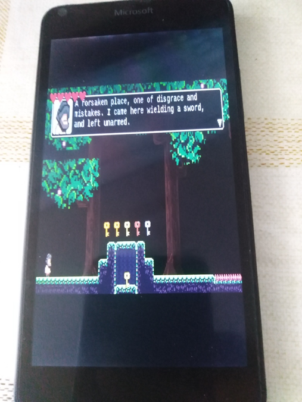

# 999AD 1.0-pre-alpha - main branch 

"UWP-remake" of ITCH.io 999AD arcade (platformer?) game project.

## Screenshots

## Status
- UWP app
- Min. Win. SDK = 10240, and Win. SDK 19041 used
- Work-in-progress

## ToDo
- Fix System.Runtime.Serialization.Formatters (compatibility with UAP 10240)
- Fix load objects bug
- Fix Save game data / load game data
- Fix screen scaling problem
- Fix input mechanics (mous / touchpanel support) 
- Add some cool music theme

## .
As is. No support. DIY. Learn purposes only.

## Reference(s)
- https://ivanpalazzo.itch.io/999adOriginal project 

## ..
[m][e] March 2025
