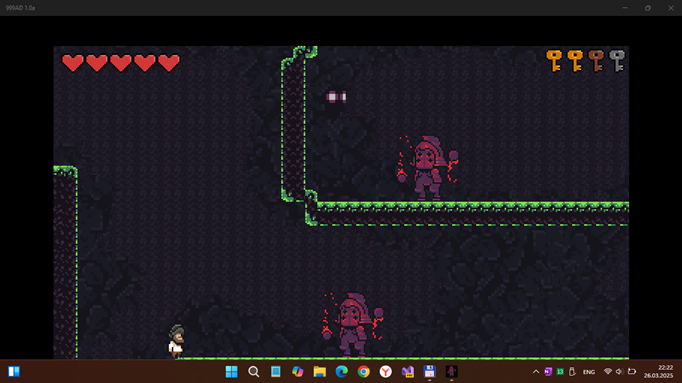

# 999AD 1.0.1-alpha - dev branch 

"UWP-remake" of ITCH.io 999 A.D. arcade (platformer?) game project.

## Screenshots

## Status
- UWP app (quickly tested on my Lumia 950 and 640, and old notebooks Sony Vaio & Surface Pro 4)
- Min. Win. SDK = 10240, and Win. SDK 19041 used
- Alpha version is ready (but save/load game data not reconstructed yet!)
- Semi-God mode activated (jump power increased, and lifeTimes always is 5))

## ToDo
- Fix System.Runtime.Serialization.Formatters (compatibility with UAP 10240)
- Fix load objects bug
- Fix Save game data / load game data
- Create Settings item in main Menu (+ add Godmode on/off & Sound of/off & Music on/off parameters)
- Fix sound distortion in mega-boss end scene (and boss super-power so strang, game mission impossible!!)
- Add some cool music theme ;)

## .
As is. No support. DIY. Learn purposes only.

## Reference(s)
- https://ivanpalazzo.itch.io/999AD Original project 

## ..
[m][e] March 2025
